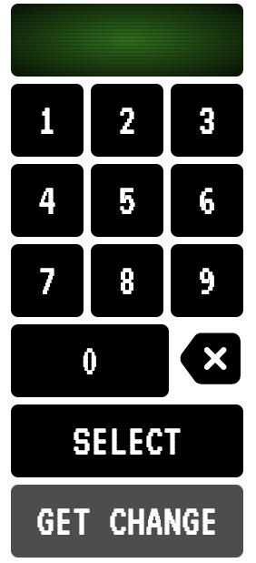
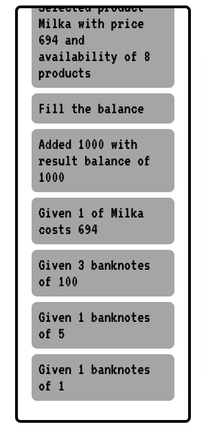

<h1 align="center">"Вендинговый аппарат"</h1>

## 1) Вводите код товара в терминале:

<center></center>

<br>

## 2) Пополняете баланс:

<center></center>

<br>

## 3) Берете сдачу:

<center></center>

<br>

## 4) Следите за статусом в логгере:

<center></center>

<br>

Сайт доступен по ссылке: https://2000ilya.github.io/vending-machine/

<br>

## Для запуска проекта локально:

```bash
npm install && npm start
```
